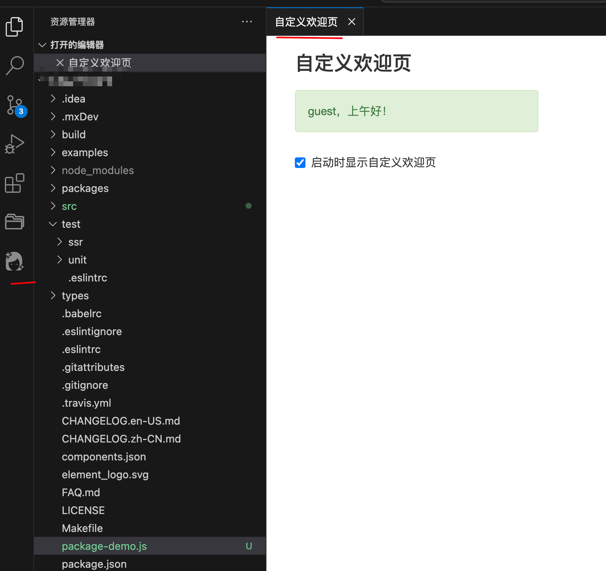
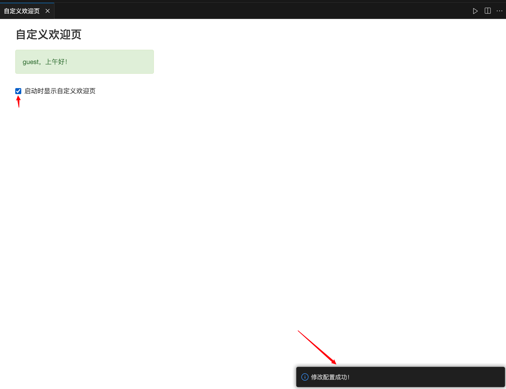
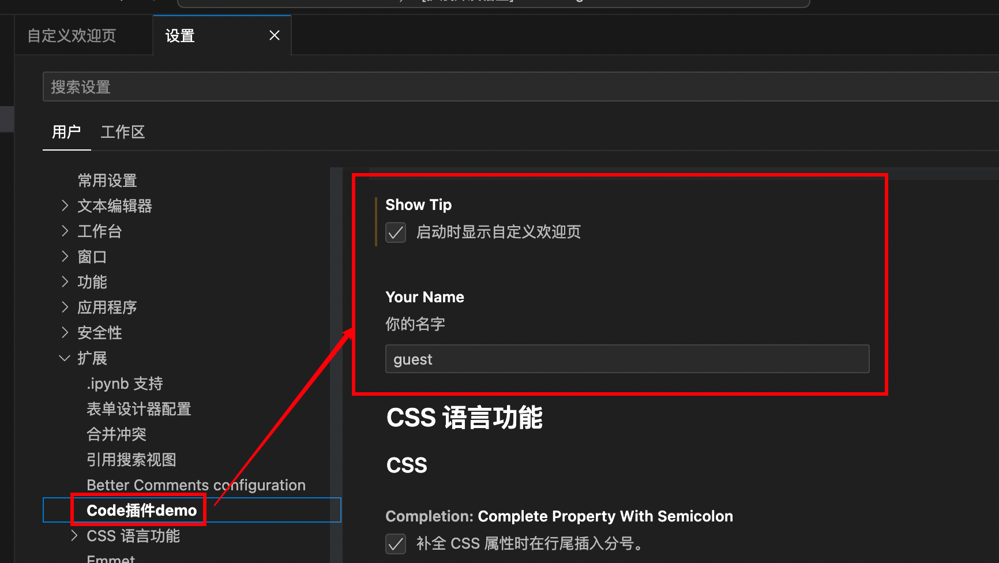
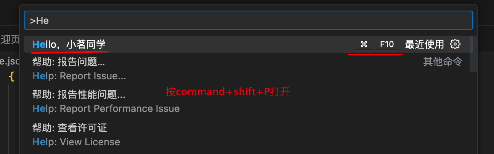
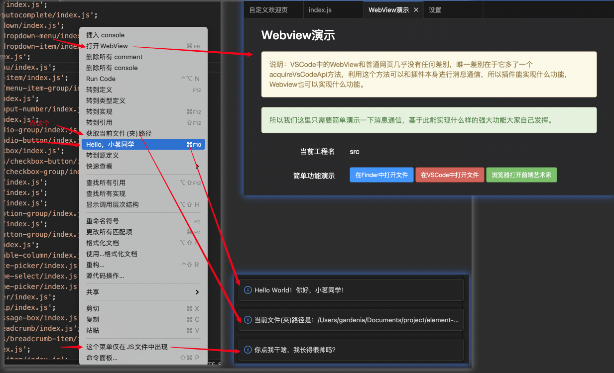
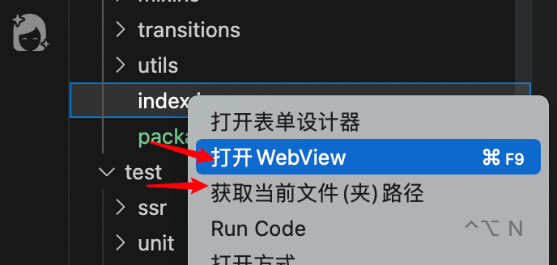
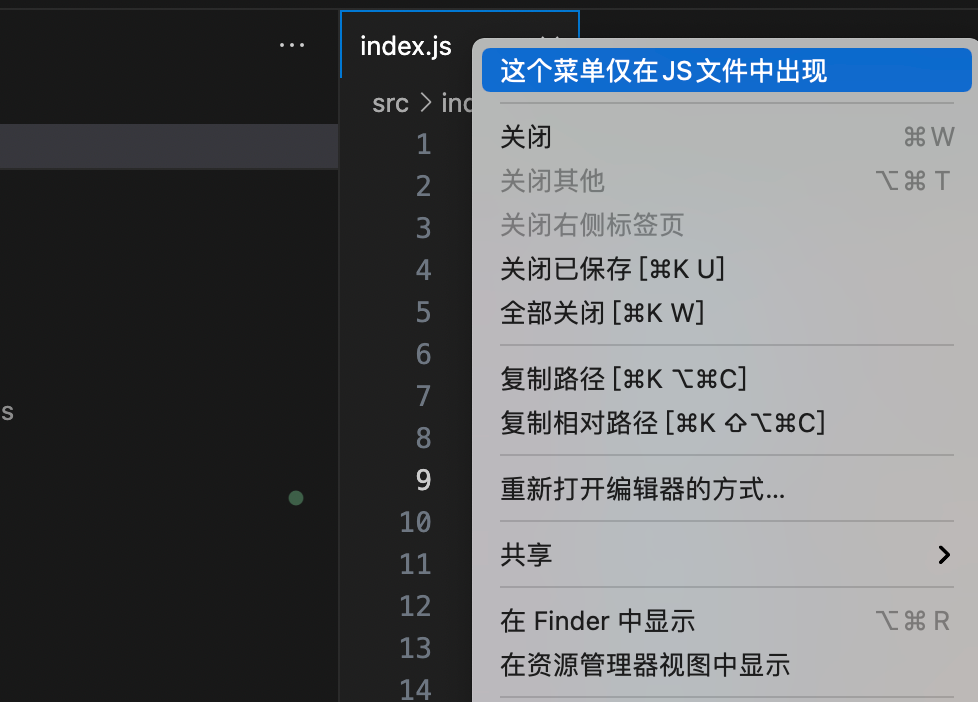
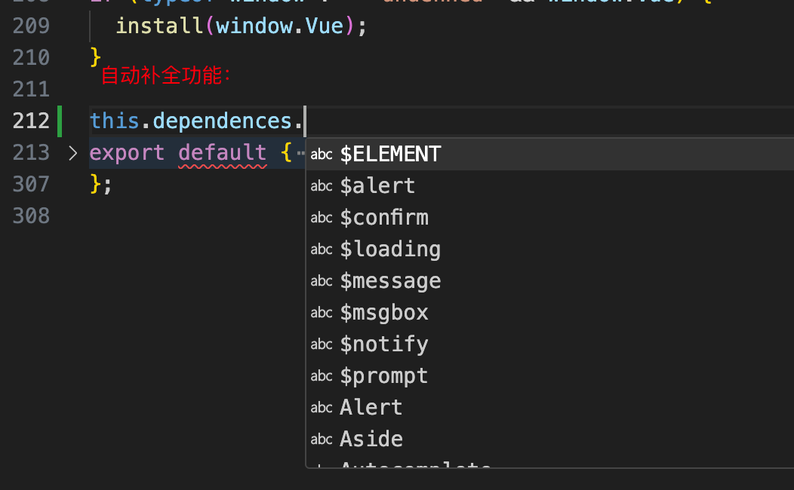
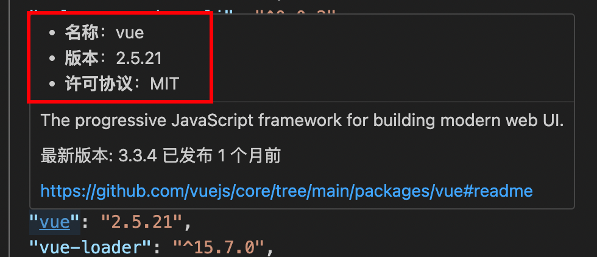
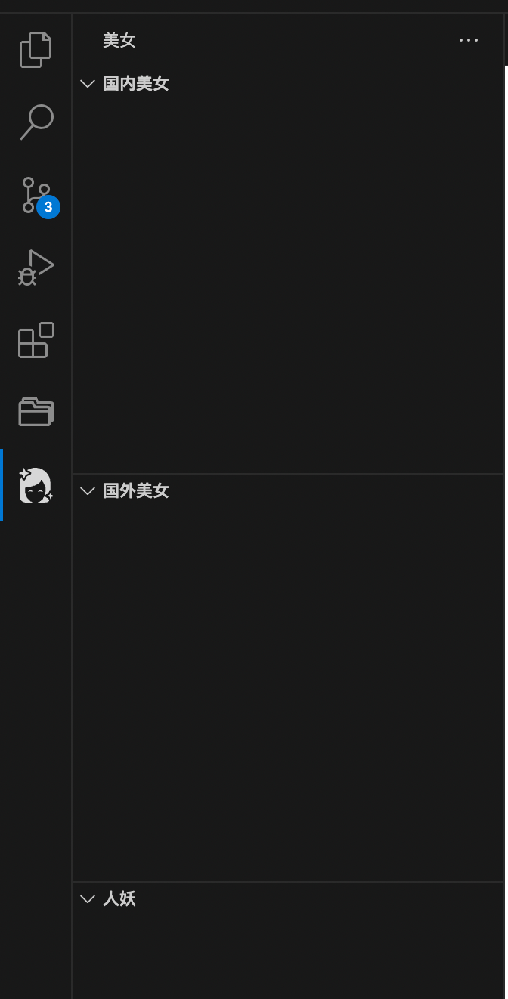

# vscode-plugin-demo

VSCode插件开发全攻略系列文章配套demo。

# 文章索引

* [VSCode插件开发全攻略（一）概览](http://blog.haoji.me/vscode-plugin-overview.html)
* [VSCode插件开发全攻略（二）HelloWord](http://blog.haoji.me/vscode-plugin-hello-world.html)
* [VSCode插件开发全攻略（三）package.json详解](http://blog.haoji.me/vscode-plugin-package-json.html)
* [VSCode插件开发全攻略（四）命令、菜单、快捷键](http://blog.haoji.me/vscode-plugin-command-and-menu.html)
* [VSCode插件开发全攻略（五）跳转到定义、自动补全、悬停提示](http://blog.haoji.me/vscode-plugin-jump-completion-hover.html)
* [VSCode插件开发全攻略（六）开发调试技巧](http://blog.haoji.me/vscode-plugin-develop-tips.html)
* [VSCode插件开发全攻略（七）WebView](http://blog.haoji.me/vscode-plugin-webview.html)
* [VSCode插件开发全攻略（八）代码片段、设置、自定义欢迎页](http://blog.haoji.me/vscode-plugin-snippets-and-settings.html)
* [VSCode插件开发全攻略（九）常用API总结](http://blog.haoji.me/vscode-plugin-common-api.html)
* [VSCode插件开发全攻略（十）打包、发布、升级](http://blog.haoji.me/vscode-plugin-publish.html)

## 启动执行
```
yarn
```
然后，点击vscode上菜单“运行”————“调试执行”。或者按“F5”

启动后会自动弹出一个欢迎页面：

可修改配置：








当输入 this.dependencies.xxx时自动把package.json中的依赖带出来：
鼠标悬停提示，当鼠标停在package.json的dependencies或者devDependencies时，自动显示对应包的名称、版本号和许可协议：
